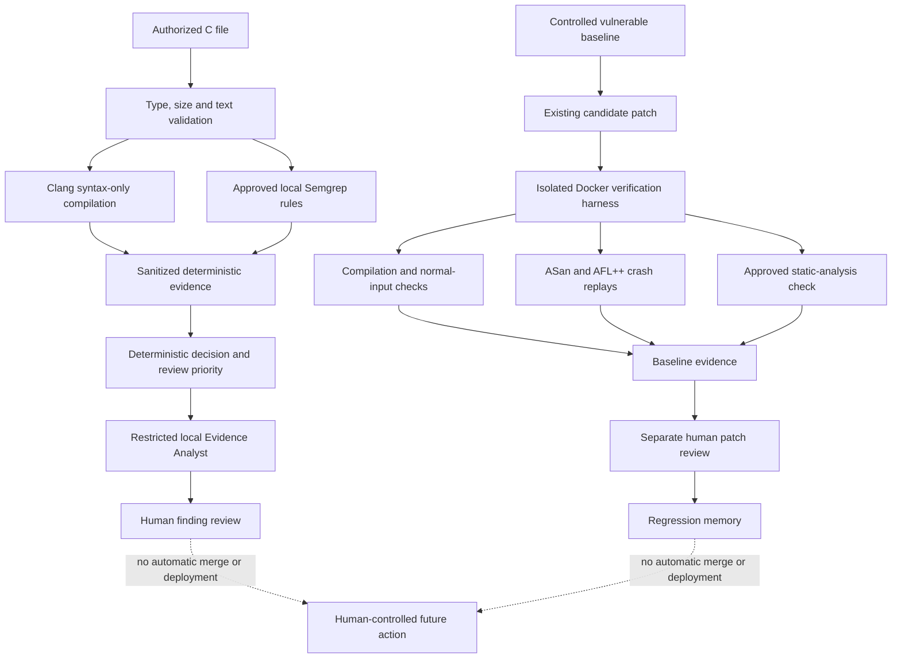
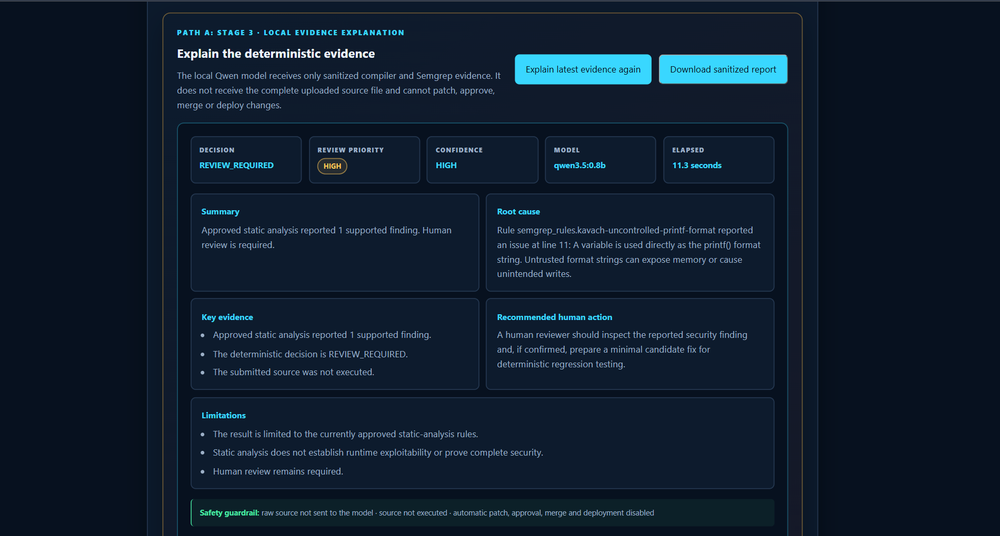
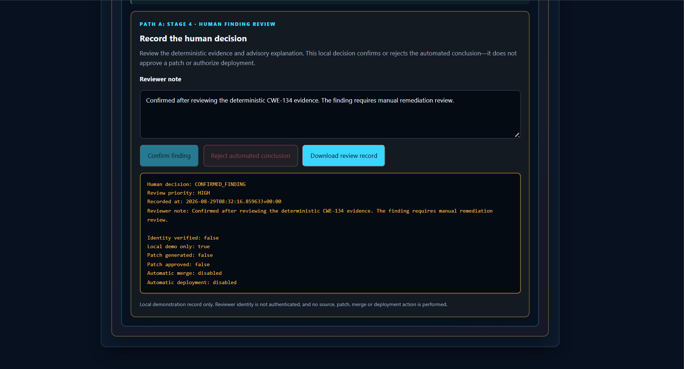
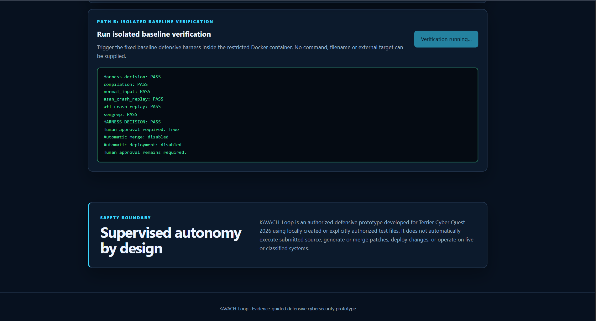

# KAVACH-Loop

**Find the flaw. Test the fix. Keep humans in the loop.**

KAVACH-Loop is an evidence-guided defensive security prototype developed for **Terrier Cyber Quest 2026**.

It combines deterministic security analysis, restricted local AI explanation, human review and isolated baseline verification. Automated components produce and explain evidence, but they cannot approve patches, merge code or deploy changes.

## Demo

[Watch the KAVACH-Loop demonstration](docs/demo/kavach-loop-tcq-2026-demo.mp4)
[Open the public static dashboard](https://surasanivaishnavi.github.io/KAVACH-Loop/)

The public dashboard displays saved sanitized evidence. Live file analysis,
local AI explanation and container verification are available only when the
project is run locally through Docker.

The demonstration includes:

- Two supported C vulnerability classes
- Deterministic review priority
- Restricted local AI evidence explanation
- A working human finding-review gate
- Downloadable sanitized evidence
- Isolated baseline regression verification

## Current platform

KAVACH-Loop contains two clearly bounded paths.

### Path A — Authorized C-file analysis

Path A accepts one explicitly authorized standalone C file of up to 64 KiB.

It performs:

1. File-type, size and text validation
2. Clang syntax-only compilation
3. Approved local Semgrep analysis
4. Deterministic decision and review-priority calculation
5. Restricted local AI explanation of sanitized evidence
6. Human confirmation or rejection of the automated conclusion
7. Downloadable sanitized evidence and review records

The uploaded program is never executed.

Path A does not generate or approve a patch.

### Path B — Baseline remediation proof

Path B preserves the original controlled remediation demonstration.

It contains:

1. A deliberately vulnerable local C sample
2. Reproducible ASan and AFL++ crash inputs
3. An existing minimal patch candidate
4. Compilation and normal-input checks
5. ASan and AFL++ crash regression replays
6. Approved Semgrep verification
7. Separate recorded human patch review
8. SHA-256-protected regression evidence

Path B verifies only the fixed baseline workflow. It does not accept an uploaded filename, command, URL or external target.

## Architecture



## Evidence Analyst

The Evidence Analyst uses a local Ollama-hosted `qwen3.5:0.8b` model.

The model receives only sanitized evidence such as:

- Source metadata
- Syntax-compilation status
- A bounded compiler-diagnostic excerpt
- Approved Semgrep findings
- Deterministic decision
- Deterministic review priority

The complete uploaded source file is not sent to the model.

The model can:

- Summarize the evidence
- Explain the likely root cause
- Identify key evidence
- Recommend a human review action
- State confidence and limitations

The model cannot:

- Execute source code
- Change files
- Generate a complete replacement program
- Approve a finding or patch
- Merge code
- Deploy changes
- Override the deterministic decision or priority

Compiler and Semgrep text are treated as untrusted data. Protected decision fields are enforced outside the model response.



## Human finding-review gate

After reading the deterministic evidence and optional AI explanation, a local reviewer may record:

- `CONFIRMED_FINDING`
- `REJECTED_CONCLUSION`

A reviewer note of 10–500 characters is required.

The review record is bound to the analyzed job and source SHA-256 hash. The backend prevents a finding from being confirmed when the deterministic result contains no supported finding.

This local demonstration does not authenticate reviewer identity. Recording a finding decision does not approve a patch or authorize deployment.



## Supported controlled checks

The current general C intake demonstrates two approved Semgrep rules:

| Vulnerability class | Example | CWE |
|---|---|---|
| Unbounded string copy | `strcpy(destination, source)` | CWE-120 |
| Externally controlled format string | `printf(variable)` | CWE-134 |

The repository also includes:

- Matching safe examples
- Invalid-syntax input
- Prompt-injection-style compiler evidence
- A safe standalone C example

A result of `NO_SUPPORTED_FINDINGS` means only that the currently approved checks reported no supported findings. It does not prove that a file is vulnerability-free.

## Deterministic review priority

Review priority is calculated from deterministic evidence rather than generated by the language model.

Possible values are:

- `HIGH`
- `MEDIUM`
- `LOW`
- `NONE_IDENTIFIED`
- `UNASSESSED`

Examples:

- An `ERROR`-severity supported finding produces `HIGH`.
- No supported findings produces `NONE_IDENTIFIED`.
- Compilation or analysis failure produces `UNASSESSED`.

## Baseline verification

The baseline harness checks:

- Compilation
- Normal-input behaviour
- AddressSanitizer crash replay
- AFL++ crash replay
- Approved unsafe-`strcpy` static rule
- Human approval requirement
- Recorded evidence integrity



## Technology stack

- **Frontend:** HTML, CSS and JavaScript
- **Backend:** Python and FastAPI
- **Static analysis:** Semgrep
- **Compilation:** Clang
- **Memory-safety evidence:** AddressSanitizer
- **Fuzzing evidence:** AFL++
- **Local AI:** Ollama with Qwen
- **Isolation:** Docker and Docker Compose
- **Evidence integrity:** SHA-256
- **Version control:** Git and GitHub

## Run the complete local platform

### Requirements

- Docker
- Docker Compose
- Approximately 8 GB system memory recommended
- No GPU required

### Start the services

```bash
docker compose up --detach --build
```

For a fresh Ollama volume, download the local model:

```bash
docker compose exec kavach-ollama \
  ollama pull qwen3.5:0.8b
```

Check service health:

```bash
docker compose ps
```

Open:

```text
http://127.0.0.1:8001
```

### Stop the services

```bash
docker compose down
```

The Ollama model remains stored in the Docker volume and does not need to be downloaded after every restart.

## API endpoints

| Method | Endpoint | Purpose |
|---|---|---|
| `GET` | `/api/health` | Local API health |
| `GET` | `/api/status` | Sanitized recorded baseline status |
| `GET` | `/api/evidence` | Sanitized baseline evidence |
| `POST` | `/api/verify` | Run the fixed baseline harness |
| `POST` | `/api/analyze/c` | Analyze one authorized C file |
| `GET` | `/api/agent/status` | Evidence Analyst availability |
| `POST` | `/api/agent/analyze-evidence` | Explain sanitized evidence |
| `POST` | `/api/review/finding` | Record a local human finding decision |
| `GET` | `/api/docs` | Interactive API documentation |

## Container security controls

The API container uses:

- Non-root user `10001:10001`
- Read-only root filesystem
- All Linux capabilities dropped
- `no-new-privileges`
- PID, CPU and memory limits
- `tmpfs` runtime workspaces
- Read-only regression inputs
- API binding only to `127.0.0.1:8001`

The Ollama service:

- Is available only to the internal Docker network
- Has no published host port
- Uses a pinned container-image digest
- Runs the local evidence-explanation model

## Repository structure

```text
agents/                 Restricted Evidence Analyst
api/                    FastAPI application
approvals/              Baseline approval record
approved_patches/       Approved baseline source
controlled_inputs/c/    Safe, unsafe and adversarial C fixtures
demo/                   Terminal demonstration
docs/images/            README and PPT screenshots
docs/demo/              Compressed demonstration video
evidence/               Recorded baseline evidence
harness/                Baseline and general C analyzers
memory/                 Security regression memory
patch_candidates/       Existing baseline candidate
regression_inputs/      Read-only regression inputs
reports/                Sanitized recorded reports
semgrep_rules/          Approved local C rules
vulnerable_samples/     Deliberately vulnerable baseline
website/                Local dashboard
```

## Version evolution

### Version 1 — Deterministic baseline

Introduced:

- Controlled vulnerable C sample
- Minimal candidate patch
- Semgrep, ASan and AFL++ evidence
- Deterministic verification harness
- Human approval record
- Regression memory and integrity manifest

Preserved by the `v1.0-baseline` tag.

### Version 2 — Restricted container API

Added:

- FastAPI service
- Interactive dashboard
- Restricted Docker container
- Local-only API exposure
- Live isolated baseline verification

Preserved by the `v2.0-container-api` tag.

### Version 3 — Controlled intake and local evidence explanation

Added:

- Authorized standalone C-file intake
- Multiple approved vulnerability rules
- Safe and adversarial test fixtures
- Deterministic review priority
- Restricted local Evidence Analyst
- Structured evidence interface
- Downloadable sanitized reports
- Real human confirmation and rejection controls
- Source-hash-bound local review records

Version 3 integrates the earlier baseline and container functionality into one platform while keeping their scopes distinct.
The current Version 3 work is developed in the
`v3-controlled-c-intake` branch.

## Current limitations

KAVACH-Loop is a defensive proof of concept, not a production security platform.

Current limitations include:

- General intake supports standalone C files only
- Only approved local rules are evaluated
- Uploaded files are not dynamically executed
- Path A does not generate patches
- Static analysis cannot prove complete security
- The local AI explanation is advisory
- Human reviewer identity is not authenticated
- No role-based access control
- No automatic merge or deployment
- No operation on live or classified systems

## Safety boundary

Use KAVACH-Loop only with locally created or explicitly authorized files.

The project is not designed to scan unauthorized systems, execute untrusted uploaded programs, merge code automatically or deploy changes without human control.